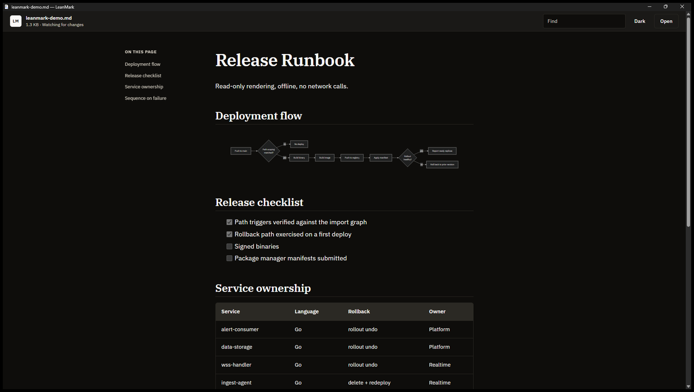

# LeanMark

**Read Markdown and Mermaid diagrams without opening an IDE. Everything renders
offline, with no Electron and no telemetry.**



*Mermaid flowcharts, GFM tables, and task lists, rendered offline.*

Most Markdown tools are editors. VS Code, Typora, Obsidian, and MarkText are
built for writing, and most of them run on Electron. LeanMark is for reading.

It renders GitHub-flavored Markdown, local images, and Mermaid diagrams entirely
offline, using the system web runtime rather than a bundled Chromium. Raw HTML is
disabled, a strict CSP is enforced, and remote images and navigation are blocked,
which makes it usable in environments where outbound network calls are not
permitted.

## Install

On Windows:

```powershell
winget install abooodbah.LeanMark
```

This installs the portable Windows build. The optional installer inside the ZIP
adds Start menu and Open With entries; see [Windows x64](#windows-x64).

Windows, Linux (.deb), and macOS builds are also on the
[Releases](https://github.com/abooodbah/leanmark/releases) page.

## Platform releases

| Operating system | Architecture | v0.3.0 artifact | Runtime and verification |
| --- | --- | --- | --- |
| Windows 10 / 11 | x64 | [ZIP](https://github.com/abooodbah/leanmark/releases/download/v0.3.0/LeanMark-v0.3.0-windows-x64.zip) | Evergreen WebView2; Windows 11 runtime-verified |
| Ubuntu 24.04 / compatible Debian-based systems | x86-64 | [DEB](https://github.com/abooodbah/leanmark/releases/download/v0.3.0/LeanMark-v0.3.0-linux-x86_64.deb) | GTK 4 + WebKitGTK 6.0; package and WebKit smoke-verified in CI |
| macOS 12 or later | Intel + Apple silicon | [Universal app preview ZIP](https://github.com/abooodbah/leanmark/releases/download/v0.3.0/LeanMark-v0.3.0-macos-universal-preview.zip) | Preview: system WKWebView; CI verifies both Mach-O slices and a real WebKit smoke test |

Each artifact has an adjacent <code>.sha256</code> sidecar on the
[v0.3.0 release](https://github.com/abooodbah/leanmark/releases/tag/v0.3.0).
Runtime-verified records tested coverage; it does not imply publisher signing.
Windows ARM64, Linux ARM64, and distro-independent Linux packages are not part
of this release.

> [!IMPORTANT]
> The Windows executable is unsigned. The macOS preview bundle is ad-hoc signed with
> the hardened-runtime flag but is not Developer ID signed or notarized.
> Windows SmartScreen or macOS Gatekeeper may therefore require an explicit
> trust decision. Official project binaries are limited to assets attached to
> this repository's GitHub Releases. The published checksum proves byte
> identity with the release asset; it does not replace platform code signing.

## Package use

### Windows x64

The extracted ZIP is portable. <code>LeanMark.exe</code>,
<code>WebView2Loader.dll</code>, and the <code>assets</code> directory must
remain together. Markdown paths may be opened from the application or passed
as command-line arguments.

The optional current-user integration entry point is:

~~~powershell
powershell.exe -NoProfile -ExecutionPolicy Bypass -File .\installer\install.ps1 -OpenDefaultAppsSettings
~~~

It copies LeanMark to <code>%LOCALAPPDATA%\Programs\LeanMark</code>, creates
Start menu and Open With entries, and registers Default Apps capabilities. It
does not write or delete Windows' protected <code>UserChoice</code> value.
Removal is available through Windows Settings or the installed uninstaller:

~~~powershell
powershell.exe -NoProfile -ExecutionPolicy Bypass -File "$env:LOCALAPPDATA\Programs\LeanMark\uninstall.ps1"
~~~

### Linux x86-64

The Debian package declares its GTK 4 and WebKitGTK 6.0 dependencies. A local
download can be installed through APT:

~~~sh
sudo apt install ./LeanMark-v0.3.0-linux-x86_64.deb
~~~

The package installs <code>/usr/bin/leanmark</code>, desktop and AppStream
metadata, the application icon, and the offline reader assets. It advertises
Markdown support to the desktop without forcibly replacing an existing default
application.

### macOS universal preview

The ZIP contains <code>LeanMark.app</code> with native Intel and Apple-silicon
slices. The application bundle may be placed in <code>/Applications</code> or
another application directory. Finder recognizes the four supported Markdown
extensions and offers LeanMark as a viewer.

Because the v0.3.0 preview is not notarized, Gatekeeper may block the first launch.
macOS records any explicit approval under **System Settings > Privacy &
Security**. Environments that require a Developer ID/notarized application are
not supported by this release.

## Use cases and scope

LeanMark is designed for:

- opening a local README or generated report without loading an editor;
- offline GFM tables, task lists, local images, and Mermaid diagrams;
- focused reading without vault, workspace, or authoring features; and
- inspectable, MIT-licensed source with reproducible package checks.

LeanMark is not a Markdown editor, an Obsidian-style knowledge base, a
browser-free renderer, or a claim to the lowest possible RAM use.

## Reader features

- CommonMark plus GFM tables, task lists, autolinks, and strikethrough.
- Lazy, offline Mermaid rendering with strict mode and bounded diagram input.
- Relative local images and relative Markdown document links.
- Automatic outline, find, reading progress, zoom, printing, and system/light/
  dark themes.
- A copy button on every heading that copies that section's Markdown, and a
  toolbar button that copies the whole file. The copy comes from the file, not
  the rendered page.
- On Windows, every Markdown file you open joins the running window as a tab.
  Background tabs keep no rendered page and are read again when selected.
- Live refresh after a save while retaining the last complete render and
  approximate reading position.
- Support for <code>.md</code>, <code>.markdown</code>, <code>.mdown</code>,
  and <code>.mkd</code>.
- UTF-8 validation and a 32 MiB document safety limit.

| Action | Windows / Linux | macOS |
| --- | --- | --- |
| Open a Markdown file | Ctrl+O | Command+O |
| Find | Ctrl+F | Command+F |
| Next / previous match | Enter / Shift+Enter or F3 / Shift+F3 | Enter / Shift+Enter |
| Reload from disk | Ctrl+R | Command+R |
| Zoom in / out / reset | Ctrl++ / Ctrl+- / Ctrl+0 | Command++ / Command+- / Command+0 |
| Cycle reader theme | Ctrl+Shift+T | Command+Shift+T |
| Copy the whole document | Ctrl+Shift+C | Command+Shift+C |
| Next / previous tab (Windows) | Ctrl+Tab / Ctrl+Shift+Tab | Window menu |
| Go to tab 1 to 8 / last tab (Windows) | Ctrl+1 to Ctrl+8 / Ctrl+9 | Window menu |
| Close tab (Windows) | Ctrl+W | Window menu |
| Open a link in a new tab (Windows) | Ctrl+click or middle-click | Not available |
| Print | Ctrl+P | Command+P |
| Leave find | Escape | Escape |

Mermaid uses its familiar fenced syntax:

~~~~text
~~~mermaid
flowchart LR
    File[Markdown file] --> Parse[Portable MD4C core]
    Parse --> Host[Native desktop host]
    Host --> Read[LeanMark reader]
~~~
~~~~

## Architecture

~~~mermaid
flowchart LR
    File[Local Markdown file] --> Core[Portable C++ / MD4C core]
    Core --> Host{Native host}
    Host -->|Win32| W[WebView2]
    Host -->|GTK 4| L[WebKitGTK]
    Host -->|AppKit| M[WKWebView]
    W --> Reader[Shared offline reader]
    L --> Reader
    M --> Reader
~~~

The parser owns UTF-8 validation, the 32 MiB limit, GFM rendering, raw-HTML
disablement, and Mermaid detection. Native hosts own file dialogs, file
watching, appearance, printing, external links, and web-runtime policy. The
reader HTML, CSS, JavaScript, Mermaid bundle, and fonts are identical across
packages.

The rationale and security contract are documented in
[the cross-platform architecture decision](https://github.com/abooodbah/leanmark/blob/main/docs/architecture/cross-platform-port.md).

## Measured Windows footprint

A small package does not imply a tiny in-memory process tree. The figures below
compare the 0.2.0 and 0.3.0 releases on the same machine and day.
Each is the median of ten warm launches from
<code>tests/Measure-Performance.ps1</code> with a three-second observation
window, and covers LeanMark plus every WebView2 process it starts. No Linux or
macOS values are inferred from them.

| Measurement | Simple, 0.2.0 | Simple, 0.3.0 | Showcase, 0.2.0 | Showcase, 0.3.0 |
| --- | ---: | ---: | ---: | ---: |
| Native window visible | 70.39 ms | 74.15 ms | 93.43 ms | 88.62 ms |
| Peak private memory, full process tree | 163.91 MiB | 96.79 MiB | 205.70 MiB | 125.31 MiB |
| Peak working set, full process tree | 335.57 MiB | 294.71 MiB | 372.25 MiB | 339.08 MiB |
| Observed process count | 7 | 6 | 7 | 6 |

Opening five documents in one launch (the four test fixtures and this README)
peaked at 447.66 MiB private and 15 processes in 0.2.0, which started a reader
per document. 0.3.0 opens them as tabs of one reader and peaked at
120.56 MiB and 6 processes, because only the visible tab is rendered. Two of the
ten 0.2.0 launches joined the previous launch's still-running browser, so their
trees were incomplete; that median uses the other eight.

Environment: Windows 11 Pro build 26200, Intel Core i7-13620H, 16 logical
processors, 15.6 GiB RAM, and WebView2 Runtime 153.0.4234.48. Hardware, system
state, runtime version, and document complexity affect results.

The measurement helper and method are documented in
[tests/README.md](https://github.com/abooodbah/leanmark/blob/main/tests/README.md).
No unmeasured comparison against VS Code or
another application is claimed.

## Privacy and security

Markdown is treated as untrusted input:

- MD4C runs with raw HTML disabled.
- The reader uses a strict, deny-by-default Content Security Policy.
- Application assets and current-document images use separate origins.
- Document image handlers canonicalize paths and reject directory traversal and
  symlink escapes.
- Remote images, unrequested navigation, downloads, popups, permissions, and
  script dialogs are blocked.
- Mermaid runs with <code>securityLevel: "strict"</code>.
- External HTTP(S) and mail links leave the reader only after a click and open
  through the operating-system handler. No command shell is involved.
- WebKit hosts use nonpersistent browser data stores; all rendering libraries
  and fonts are bundled locally.

LeanMark's own code makes no network requests. On Windows, however, the page is
drawn by Microsoft's WebView2 runtime, which can contact Microsoft services on
its own. On one Windows 11 PC with a work account added to Windows, the runtime
held two connections to Microsoft 365 (`substrate.office.com`, port 443) while
LeanMark 0.3.0 was open. Chromium's network log from that launch recorded no
request other than LeanMark's local reader page and Windows proxy
auto-detection (WPAD) lookups, so the connections do not come from the document
or the reader. They also appeared with a new, empty WebView2 profile. Other PCs
have not been measured.

Windows security smoke tests exercise hostile input in WebView2. Linux and
macOS CI run their platform-specific source policy, core, package/bundle, and
real-WebKit checks.

Private vulnerability reports follow
[SECURITY.md](https://github.com/abooodbah/leanmark/blob/main/SECURITY.md).

## Source builds

Node.js 20 or later installs the pinned Mermaid and IBM Plex build-time assets.
Node.js is not a runtime dependency.

### Windows

Requirements: Visual Studio 2022 Build Tools with MSVC v143, the Evergreen
WebView2 Runtime, and Node.js.

~~~powershell
.\scripts\build.ps1 -Configuration Release -Platform x64
.\tests\Test-LeanMark.ps1 -DistPath .\dist
.\scripts\package-release.ps1 -Version 0.3.0
~~~

### Linux

Requirements: CMake 3.22+, Ninja, a C++17 compiler, pkg-config, GTK 4,
WebKitGTK 6.0, Node.js, and Debian packaging tools. Ubuntu 24.04 build packages:

~~~sh
sudo apt install build-essential cmake ninja-build pkg-config \
  libgtk-4-dev libwebkitgtk-6.0-dev
./scripts/package-linux.sh --version 0.3.0
~~~

### macOS

Requirements: macOS 12+, Xcode command-line tools, CMake 3.24+, and Node.js.

~~~sh
npm ci --ignore-scripts --no-audit --no-fund
cmake -S . -B obj/macos -G Xcode -DCMAKE_BUILD_TYPE=Release
cmake --build obj/macos --config Release
ctest --test-dir obj/macos -C Release --output-on-failure
cmake --build obj/macos --config Release --target package_macos
~~~

Developer ID signing and notarization require credentialed, protected release
automation and are not simulated by the public CI build.

### Project map

- <code>src/core/</code>: portable file policy, UTF-8 validation, and MD4C
  rendering.
- <code>src/</code>: Windows host, resources, and Visual Studio project.
- <code>src/linux/</code> and <code>packaging/linux/</code>: GTK/WebKitGTK
  host and Debian metadata.
- <code>macos/</code>: AppKit/WKWebView host, bundle metadata, and packaging.
- <code>assets/</code>: shared trusted reader UI and security policy.
- <code>scripts/</code>: deterministic asset and release staging.
- <code>tests/</code>: static invariants, hostile fixtures, runtime/DOM smoke,
  package checks, and performance helpers.
- <code>site/</code>: dependency-free GitHub Pages product site.

## Contributing

Compatibility reports based on real, non-private Markdown documents are
welcome, especially documents containing local images or Mermaid blocks.
Rendering issues belong in the
[issue tracker](https://github.com/abooodbah/leanmark/issues/new/choose).

Contribution guidance, current priorities, and release history are documented
in
[CONTRIBUTING.md](https://github.com/abooodbah/leanmark/blob/main/CONTRIBUTING.md),
[ROADMAP.md](https://github.com/abooodbah/leanmark/blob/main/ROADMAP.md), and
[CHANGELOG.md](https://github.com/abooodbah/leanmark/blob/main/CHANGELOG.md).

## License

LeanMark is free to use, modify, and redistribute under the [MIT License](LICENSE).
Bundled dependencies retain their own permissive licenses; details are in
[THIRD_PARTY_NOTICES.md](THIRD_PARTY_NOTICES.md).
