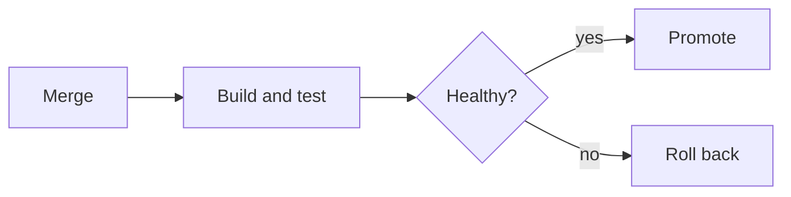
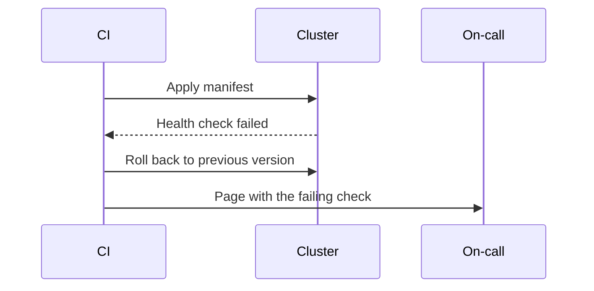

# Release Runbook

How a merged change reaches production, and what to check at each step.

## Deployment flow

## Service ownership

| Service | Language | Rollback | Owner |
| --- | --- | --- | --- |
| alert-consumer | Go | rollout undo | Platform |
| wss-handler | Go | rollout undo | Realtime |
| ingest-agent | Go | delete and redeploy | Realtime |

## Release checklist

- [x] Path triggers verified against the import graph
- [x] Rollback path exercised on a first deploy
- [ ] Release notes reviewed by the owning team
- [ ] Dashboards checked one hour after promotion

## Sequence on failure

