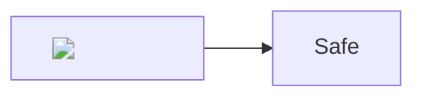

# Hostile Markdown safety fixture

Every payload in this file is a harmless sentinel. A secure build displays text,
blocks the element, or reports an inline diagram error; it never executes the
payload and never performs a remote request.

<script>window.__leanmarkXss = "raw-script";</script>


<iframe src="https://127.0.0.1:9/leanmark-must-not-frame"></iframe>
<object data="https://127.0.0.1:9/leanmark-must-not-object"></object>
<embed src="https://127.0.0.1:9/leanmark-must-not-embed">
<form action="https://127.0.0.1:9/leanmark-must-not-submit"><button>Do not submit</button></form>
<meta http-equiv="refresh" content="0;url=https://127.0.0.1:9/leanmark-must-not-navigate">
<style>body { background-image: url("https://127.0.0.1:9/leanmark-must-not-style"); }</style>

[JavaScript URL must be inert](javascript:window.__leanmarkXss='javascript-link')

[Data URL must be inert](data:text/html,<script>window.__leanmarkXss='data-link'</script>)

[Absolute executable path must be blocked](file:///C:/Windows/System32/calc.exe)


```html
<script>window.__leanmarkXss = "fenced-code";</script>
```



The final sentinel proves the rest of the document still rendered.
