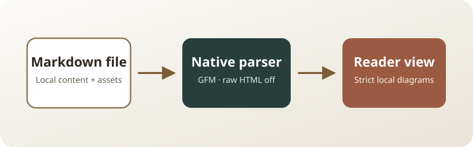
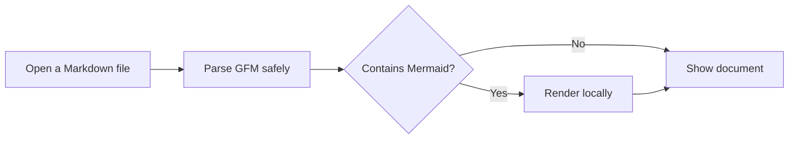
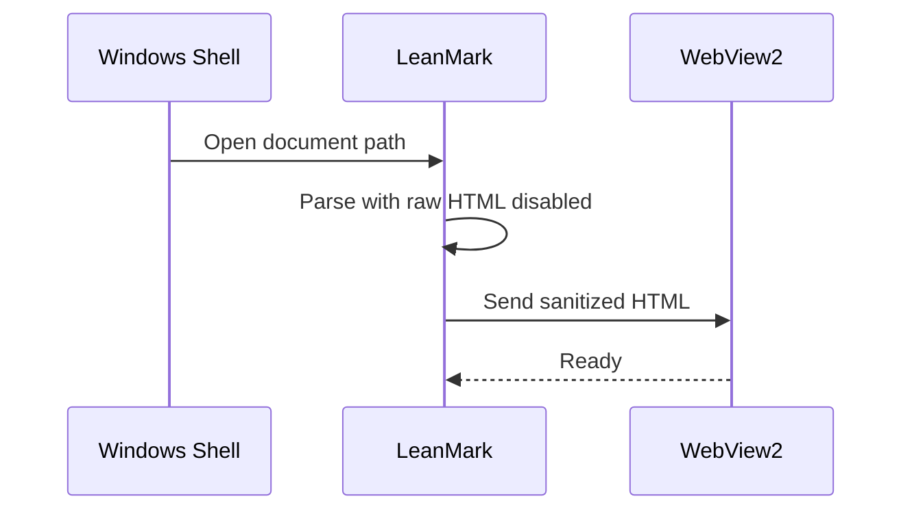

# LeanMark renderer showcase

This document is both a pleasant manual demo and a deterministic smoke-test
fixture. It covers **strong text**, *emphasis*, ~~strikethrough~~, `inline code`,
an escaped \*asterisk\*, and an entity: &copy;.

> A Markdown reader should make the document disappear into the background.
>
> The formatting should feel calm, fast, and predictable.

This backslash makes a hard line break.\
This sentence must begin on the next line.

## Lists and tasks

1. An ordered item whose marker begins at one.
2. A second item with nesting:
   - a bullet
   - another bullet
     1. a nested ordered item
3. Unicode remains intact: café, naïve, Ελληνικά, 日本語, العربية, and 🚀.

- [x] Render GFM task lists
- [ ] Keep unchecked tasks visibly read-only
- [x] Preserve nested structure

## A compact table

| Capability | Status | Detail |
| :-- | :--: | --: |
| CommonMark | Ready | 100% |
| GFM tables | Ready | 3 columns |
| Mermaid | Ready | Local-only |

## Code is content, not executable markup

```cpp
#include <string>

std::string greeting = "<strong>This stays code</strong>";
```

```json
{"reader":"LeanMark","offline":true,"diagramCount":2}
```

## Local assets

The image below is loaded relative to this Markdown file. It must remain inside
the content width and expose its alt text to assistive technology.



Continue to the [linked fixture](linked-document.md#linked-destination), jump to
[the diagrams](#diagrams), or visit [the CommonMark project](https://commonmark.org/).

## Diagrams





## Duplicate heading

The outline and anchor generator must give duplicate headings stable, unique IDs.

## Duplicate heading

This is the second heading with the same visible label.

## Wide and awkward content

The following token should wrap or stay inside a bounded overflow container rather
than widening the whole window:

`leanmark_abcdefghijklmnopqrstuvwxyz_0123456789_ABCDEFGHIJKLMNOPQRSTUVWXYZ_abcdefghijklmnopqrstuvwxyz_0123456789`

---

End of showcase.
